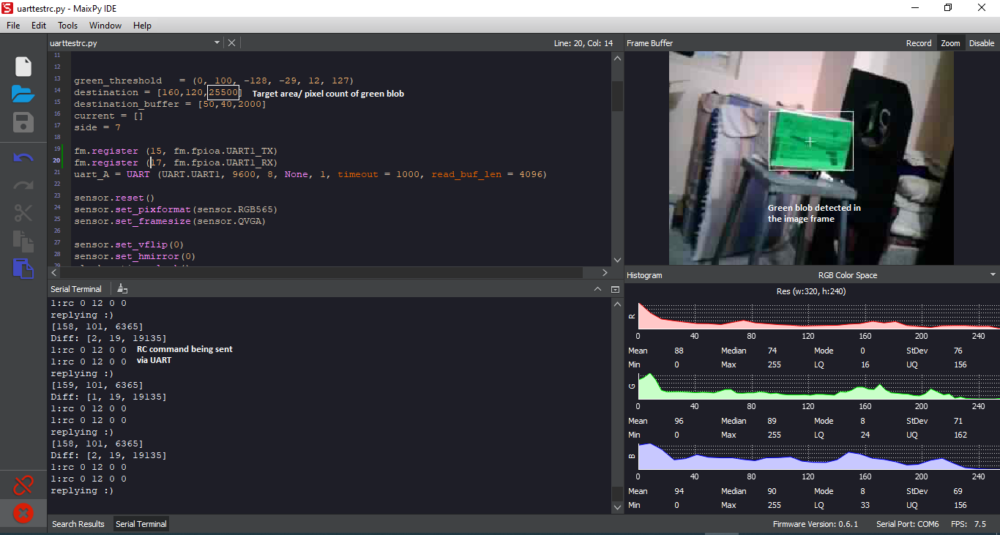
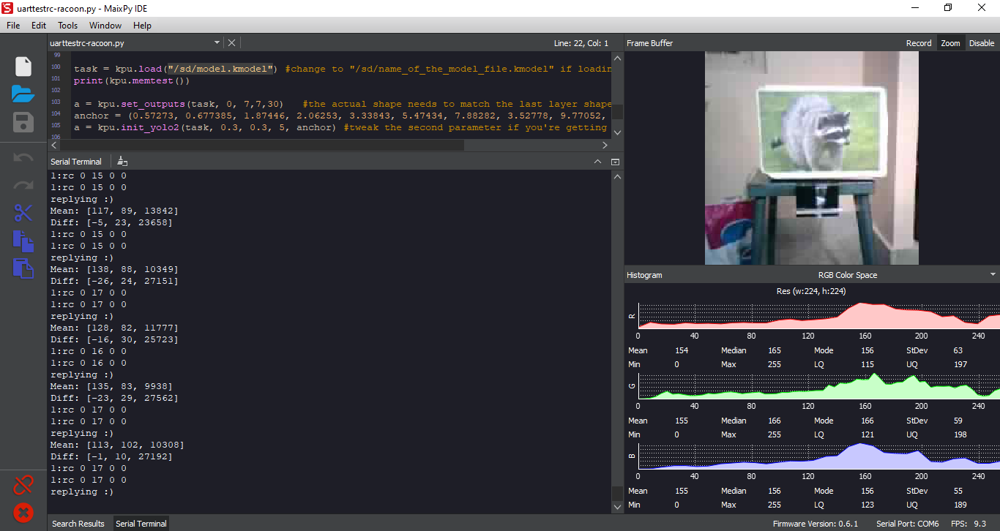
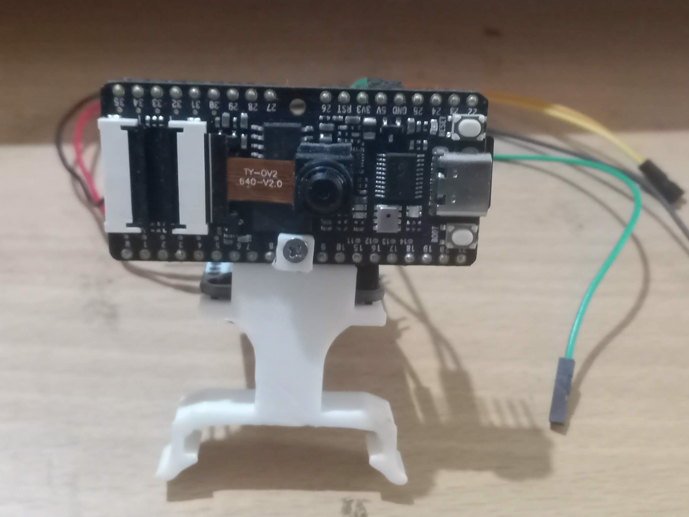
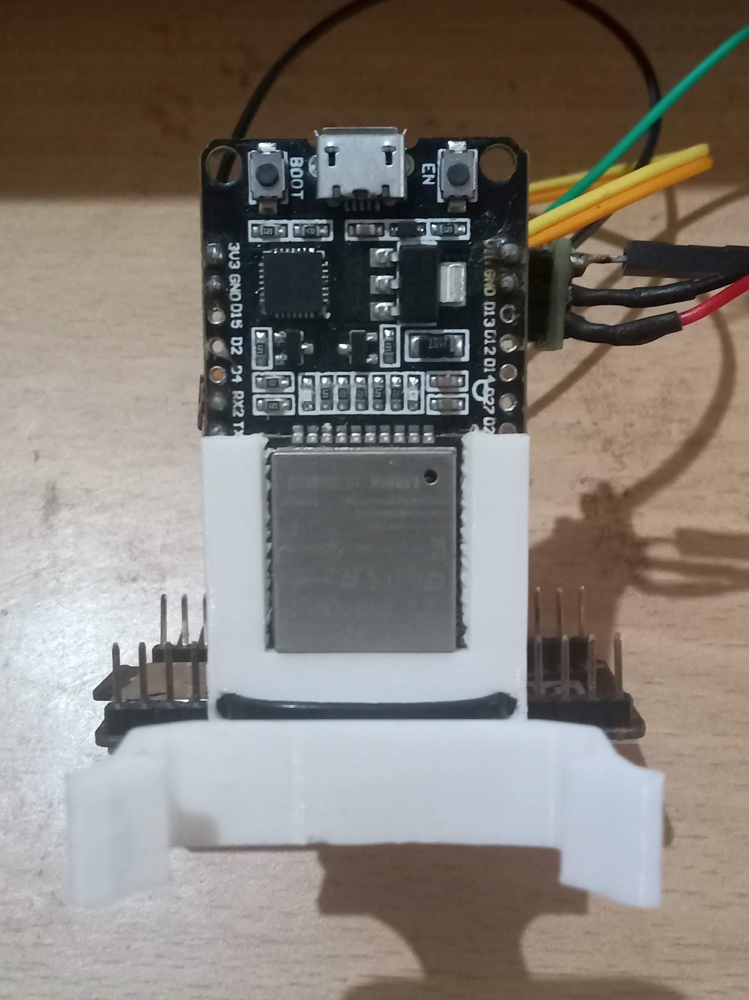
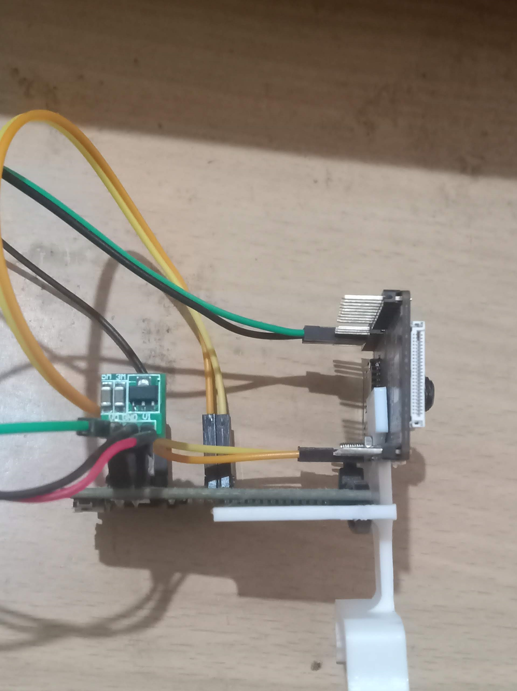
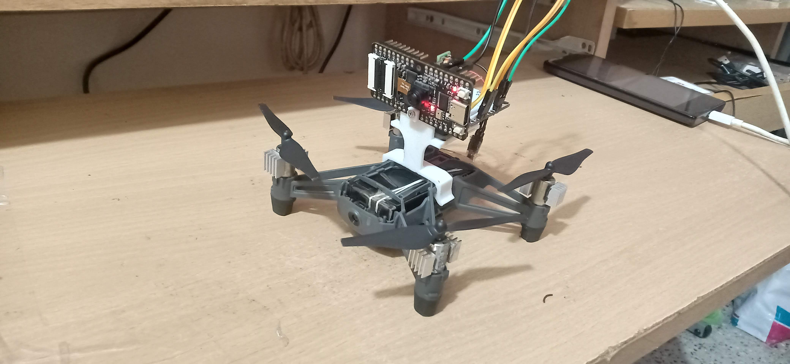
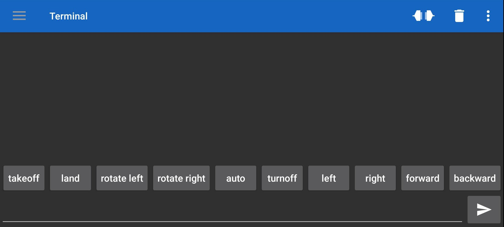
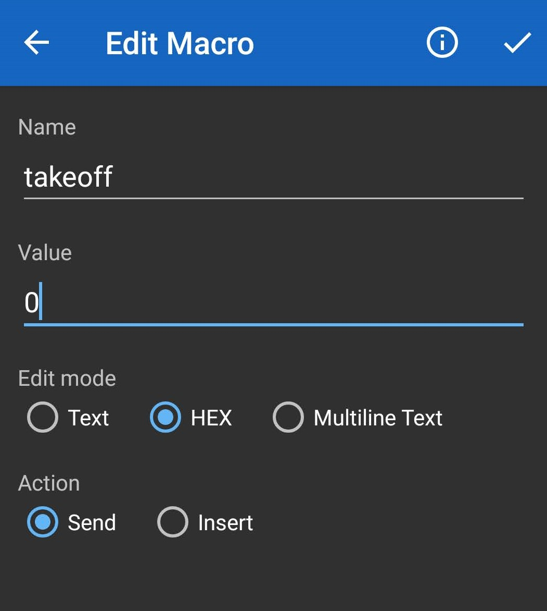

# Target following tello drone

## Intro
This repo contains code to provide tello drone the capability to follow any particular target using Sipeed maix bit board. ESP32 board is used as a communication bridge between external bluetooth app, maix bit board and tello.

As examples, the scripts added here allows the drone to follow green coloured object or raccoon for which a neural network was trained

For coloured objects the drone can align itself and move towards it.

For raccoon/object it can only detect and move towards it/follow it in straight line. This mainly was due to the viewing angle and size of the object causing detection issue. Probably better training can be done to make the object following more robust.

 

## Setting up the drone

### Hardware assembly

#### Materials
1) Sipeed maix bit board (with camera) [link](https://www.seeedstudio.com/Sipeed-MAix-BiT-for-RISC-V-AI-IoT-p-2872.html)
2) ESP32 [link](https://www.amazon.com/HiLetgo-ESP-WROOM-32-Development-Microcontroller-Integrated/dp/B0718T232Z/ref=sr_1_3?dchild=1&keywords=esp32&qid=1610295651&sr=8-3)
3) Tello [link](https://www.amazon.com/Tello-CP-PT-00000252-01-Quadcopter-Drone/dp/B07H4W5YWB/ref=sr_1_2?dchild=1&keywords=tello&qid=1610295767&sr=8-2&th=1)
4) boost converter [link](https://www.amazon.com/Comidox-Module-Voltage-Converter-0-9-5V/dp/B07L76KLRY/ref=sr_1_6?dchild=1&keywords=micro+boost+converter&qid=1610295804&sr=8-6)
5) misc. (Wires, ziptie etc)

Mount the boards as shown in the image.  

Make uart connection between the Boards as follows

ESP32 GPIO 16 (UART 2 RX)<-> k210 GPIO 15 (UART 1 TX)  
ESP32 GPIO 17 (UART 2 TX)<-> k210 GPIO 17 (UART 1 RX)

Power the boards using boost converter if using 3.7 volts. For this project the 3.7 volts was tapped from on board battery.

Snap the assembly onto the tello drone

### Software 

Create custom buttons on [Serial Bluetooth terminal app](https://play.google.com/store/apps/details?hl=en&id=de.kai_morich.serial_bluetooth_terminal) as follows:

add hex values for each starting from 0 ie takeoff = hex value 0, land = hex value 1, ...etc   

Add tello library needed by ESP32 to control the drone. [Link](https://github.com/aku-projects/ESP32-Tello)

Modify the tello wifi credentials in .ino file under resources > code > esp32 and program the same into the board.

Set up the Sipeed maix bit board based on the instructions [here.](https://maixpy.sipeed.com/en/)

Now open the micropython script in resources > code > k210 using maix py ide and save the same to the board.

use tello_rc_bt_wifi.ino and uarttestrc.py for coloured object following

use tello_rc_bt_wifi_no_dest.ino and uarttestrc-racoon.py for racoon following.
## Running the Code

Power up the tello drone and the boards. Connect to ESP32 using the app. Wait for ESP32 to connect to Tello wifi. 

Once connected. Take off manually using the corresponding button on the app. Place in Auto mode using the corresponding button. If target is detected the drone makes the manuever and hovers at a set distance from it, else lands after Tello's default timeout.

## Acknowledgment
Raccoon detector was based on the work of Dmitry Maslov. The tutorial can be found at :  https://www.hackster.io/dmitrywat/object-detection-with-sipeed-maix-boards-kendryte-k210-421d55  
The tello mount used in this project is a Remix of Raspberry Pi Zero Tello mount by zeroTM on thingiverse : https://www.thingiverse.com/thing:4022999
